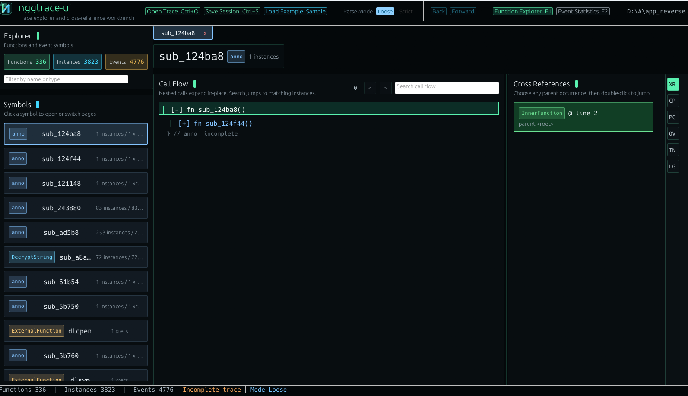
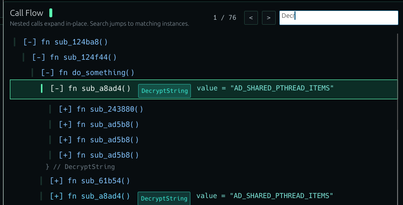
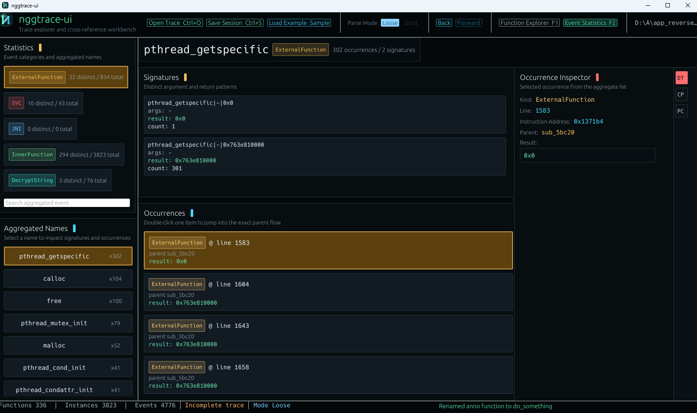

# nggtrace：基于 QBDI 的调用流 trace 工具

[📖 繁體中文](readme.md)　|　[📖 简体中文](readme_cn.md)

nggtrace 的定位很直接，就是把目标函数周围的调用流记录下来，方便用来看检测点、行为链路，或者函数之间到底是怎么串起来的。对逆向分析来说，它的价值不在于多一个 trace，而在于把原本分散的结果整理成可回看的结构。

## 🧭 它做了什么

这套工具把调用流 trace 和配套查看界面放在一起。前者负责把目标函数相关的调用过程记录下来，后者则把这些结果整理成可以浏览、搜索、交叉引用与回看的界面，让分析不再停留在零散日志。

## 🪟 看到的结果是什么

最直观的成果，是可以直接从界面里看函数之间的调用关系，而不是只盯著一长串文本输出。这让很多原本难整理的过程，能更快收敛成一条可读的脉络。

除了调用流本身，这套 UI 也把搜索和定位能力补得比较完整。对做行为追踪的人来说，这意味著你不只是能看到流程，还能更快找到想关注的函数、事件或上下文。

另一个实用点，是它把一些更适合做总览观察的内容独立出来。当你不是只想看单一路径，而是想知道某类外部函数、事件或调用模式的分布时，这种统计视图会更有价值。

## 🎯 适用场景

如果你需要一个能把函数调用关系、搜索定位和结果回看整合起来的辅助工具，这个工具可以帮到你。

## 💬 一句话说完

nggtrace 把函数调用流 trace 和可视化查看整合在一起，能更快帮你整理检测点与 APP 行为脉络。
