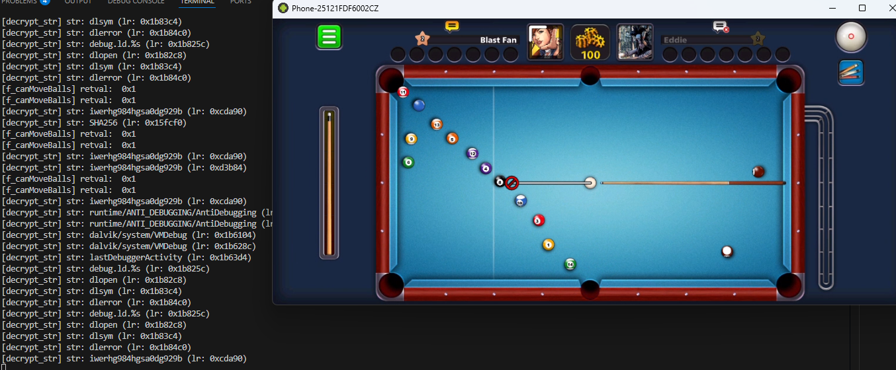
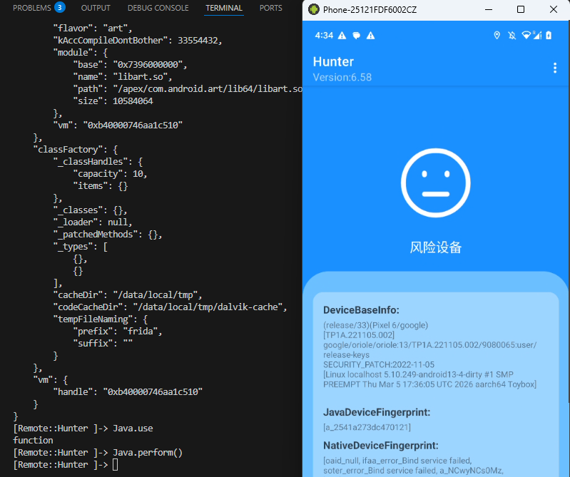

# 魔改Frida：集成 wxshadow 的无痕 Hook 版本

[📖 繁體中文](readme.md)　|　[📖 简体中文](readme_cn.md)

这套魔改 Frida 的重点很直接，就是把常见的主动 hook 能力接到 wxshadow 路径上，尽量把直接 patch 带来的可见痕迹压低。它不是一个已经收敛到很稳的通用方案，现有记录也明确提到手机仍有卡死风险，而且测试范围主要集中在较固定的内核与设备环境。

## 🧭 做了什么

- 集成wxshadow的无痕hook能力
- 去掉frida各种特征

## 🪟 测试样本

注: 只在P6, Android13, Kernel5.10上进行过测试, 其他机型/版本大概率用不了
1. 8ball (Appdome)  

2. hunter  

## 🎯 适用场景

厌倦了各种APP无穷无尽的花样检测? 或许可以试试这个工具。
